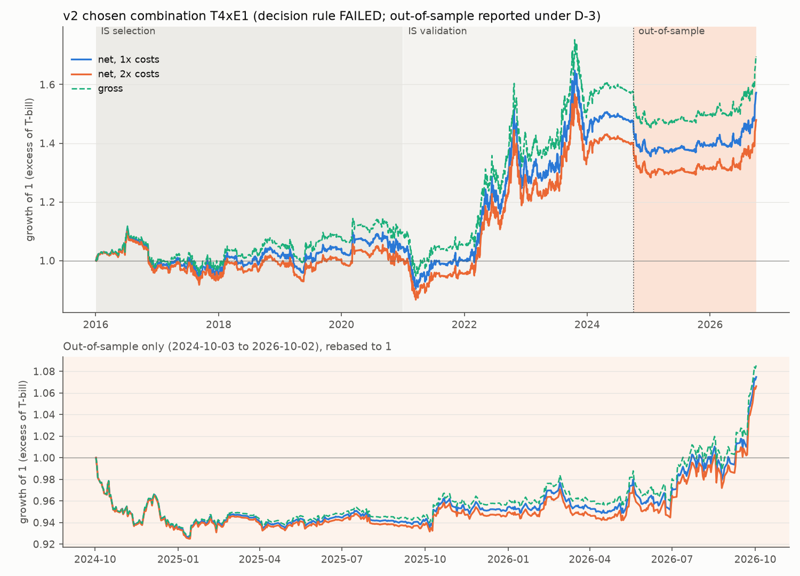
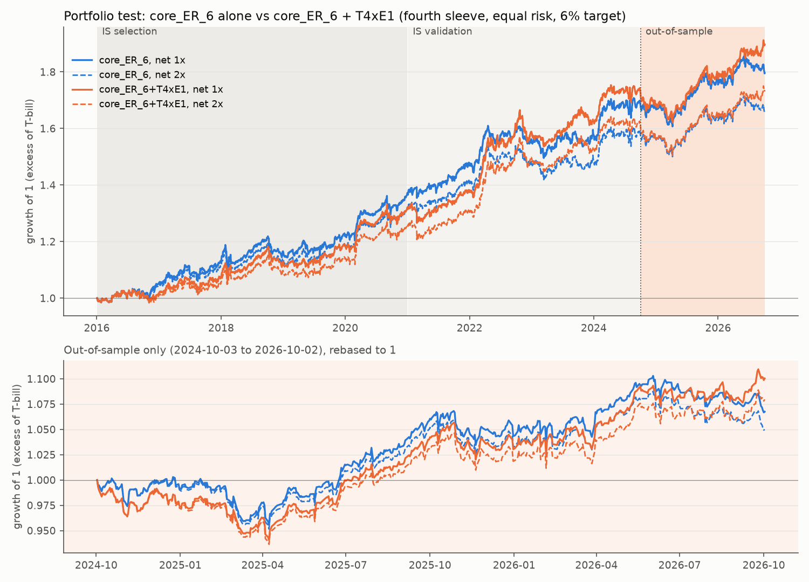
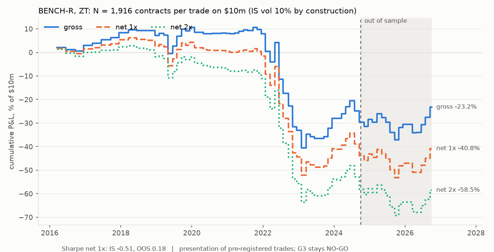
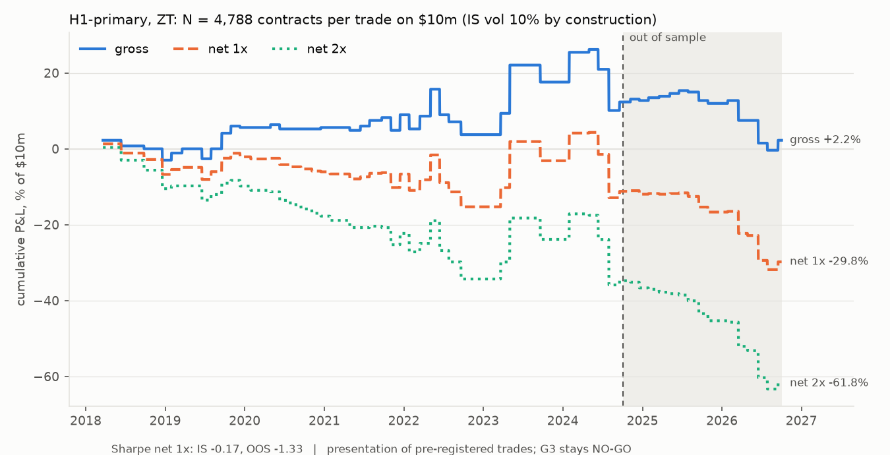

# Strategy results: in-sample and out-of-sample

> One-page Sharpe summary (with the D-4 corrections and benchmarks): `docs/results/sharpe-summary.md`.

This page collects the competition-format results (Gator Quant Hacks, Systematic Trading) for every strategy series
the team has backtested. In-sample (IS) and out-of-sample (OOS) are reported separately, net of costs at 1x and at
2x, and gross.

- In-sample runs to 2024-10-02. Out of sample is 2024-10-03 .. 2026-10-02.
- Nothing on this page is new computation. Every number comes from `backtests/results/v2_oos/` and `backtests/results/presser_strategy/`. The one
  exception is the v2 drawdown convention (section 6), recomputed from `backtests/results/v2_oos/daily_returns.csv`.
- Written 2026-10-04 (UTC). No price level appears on this page or in the files it cites.

## 1. Standing labels (read these before any number)

- **v2 (T4xE1) FAILED its pre-registered decision rule. The verdict stands.**
  - The rule (`preregistration/HYPOTHESIS_v2.md`, sha256 464f8a5b...) needs a validation net Sharpe above 0
    AND a full in-sample Sharpe at 2x costs above 0.5.
  - T4xE1 passed validation (0.687) and failed the 2x gate (**0.387 <= 0.5**).
  - Two pre-registered falsifiers also tripped:
    - the selection-window Sharpe of 0.154 is at or below 0.2;
    - 73.9% of full in-sample P&L came from 2022, more than half.
  - The Deflated Sharpe over 11 trials is 0.223 on the selection window and 0.436 on full IS.
- **Deviation D-3 opened v2's out-of-sample window once, for reporting only**
  (`preregistration/v2_DEVIATION_D3_OOS.md`, sha256 97585d3c...af1c69).
  - D-3 was committed and pushed at 01:10 UTC on 2026-10-04, before any OOS return was computed.
  - The run took place once, from 01:22:55 to 01:22:57 UTC, exit 0. Its lock record (`backtests/results/v2_oos/run/oos_chosen.json`)
    refuses any further run.
  - Code, signals, parameters, costs and windows were frozen, and nothing was re-chosen. The OOS result cannot
    reverse the failed verdict, whatever it shows.
- **The other v2 rows are reference series, not candidates.**
  - **Variant A** (strategy 01 as frozen, T0fxE1) is v2's pre-declared reference.
  - **core_ER_6** is the existing three-sleeve portfolio (vol-managed ES, month-end ZN, broad trend).
  - **core_ER_6 + T4xE1** is the pre-declared portfolio test.
  - core_ER_6's returns over 2024-10..2026-10 are not new information: they already appeared in earlier portfolio
    work.
- **H1-primary (press conference): G3 = NO-GO.**
  - Confirmation sample: Powell 2023-2026, ZT, n = 20, mean +0.50 ticks gross, one-sided sign-flip p = 0.45, 90%
    block-bootstrap CI [-4.06, 5.30] ticks.
  - The plan calls H1 non-executable and rules out a net Sharpe for H1 (ADDENDUM section 7). The H1 Sharpes below
    exist only as a presentation under D-3 and carry no inferential weight.
- **BENCH-R** is the costed benchmark of the press-conference plan.
  - It is non-blind (ADDENDUM 12): its era correlations were seen before the addendum was written.
  - Its eras are never pooled into one Sharpe for inference. The pooled IS row is shown only because the
    competition format asks for it, with the two eras next to it.
- **H2 / H3 / H4 (voice, face, combined): exploratory, post-NO-GO, pending.**
  - They were pre-registered after G3 (`preregistration/presser_H2H3H4_EXPLORATORY.md`). In the locked
    family they stay at p = 1. They cannot overturn G3, rescue H1 or support a trading claim.
  - No voice or face feature has been joined to returns yet. Note 3 records a stage-1 bug that was fixed before any
    join, with the gates unchanged.
  - No H2/H3/H4 return series exists, so none appears here. D-3 adds H4 to this presentation only once it has run.
- **The press-conference OOS window is a calendar split, not a fresh holdout.** Those trades were already in the
  press-conference results reported on 2026-10-03: 12 of the 20 G3 meetings, plus the BENCH-R decay tables.

## 2. Headline

None of these series is a pre-registered success.

- **T4xE1 out of sample:**
  - Sharpe 0.607 net 1x, **0.544 net 2x**, 0.687 gross.
  - Excess return 3.8% a year, vol 6.3%, max drawdown -7.4% from the starting NAV.
  - The OOS mean is not significant (Newey-West t 0.84). The gain comes from the window's last months: Sharpe -0.36
    over the 409 Powell sessions, +2.81 over the 92 Warsh sessions, and -0.01 without the last 20 sessions.
- **Portfolio test, OOS:** adding T4xE1 raises core_ER_6's Sharpe from 0.601 to 0.870 at 1x and from 0.456 to
  0.703 at 2x. That gain also comes from the Warsh months.
- **Variant A, OOS:** Sharpe -0.454.
- **Press-conference strategies:** neither covers its costs in sample on its designated instrument, ZT.
  - H1-primary: net 1x Sharpe -0.17 in sample, -1.33 out of sample.
  - BENCH-R: net 1x Sharpe -0.51 in sample, +0.18 out of sample, -0.02 out of sample at 2x.

## 3. Results, one table per strategy

**Abbreviations used in the tables:**
- ann. ret = annualised return; DD = drawdown.
- NW t = Newey-West t-statistic of the mean daily return.
- "1x / 2x / gross" = net of 1x costs / net of 2x costs / before costs.

**v2 rows (3.1-3.4):**
- Daily returns in excess of the 3-month T-bill.
- Max drawdown is measured from the window's starting NAV (section 6). † marks a value that differs from
  `backtests/results/v2_oos/metrics.csv`, which measures from the first day's close; that value is given under the table.

**Press-conference rows (3.5-3.6):**
- Daily returns on $10m capital, with a constant N contracts per trade, sized so that in-sample gross vol is 10%.
- Return on non-trade days is 0.
- Drawdown is measured on additive equity.

### 3.1 v2 chosen combination T4xE1 (TLT/UUP, entry at the next open) — decision rule FAILED

T4xE1 averages the z-scored lexicon and stance-model consensus of Fed communications and trades them through 75%
TLT / 25% UUP at the next session's open.

| window | dates | days | ann. ret 1x / 2x / gross | vol | Sharpe 1x / 2x / gross | max DD 1x / 2x | turnover/yr | NW t (1x) |
|---|---|---|---|---|---|---|---|---|
| IS: selection | 2016-01-04..2020-12-31 | 1259 | 1.25% / 0.43% / 2.18% | 8.11% | 0.154 / 0.053 / 0.269 | -16.1% / -17.1% | 35.0 | 0.37 |
| IS: validation | 2021-01-01..2024-10-02 | 943 | 10.00% / 9.67% / 10.50% | 14.56% | 0.687 / 0.664 / 0.721 | -17.8% / -17.8% | 15.9 | 1.45 |
| **IS: full** | 2016-01-04..2024-10-02 | 2202 | 5.00% / 4.39% / 5.74% | 11.33% | 0.441 / **0.387** / 0.507 | -18.8% / -21.7% | 26.8 | 1.41 |
| **OOS** | 2024-10-03..2026-10-02 | 501 | 3.82% / 3.42% / 4.32% | 6.30% | **0.607 / 0.544** / 0.687 | -7.4%† / -7.5%† | 17.7 | 0.84 |

- † In `backtests/results/v2_oos/metrics.csv` the OOS drawdowns are -6.6% / -6.8%, and gross is -6.5% there against -7.2% here.
- Turnover is the one-way fraction of NAV traded per year, roll trades included.
- OOS total return including the T-bill is 7.9% a year (geometric). OOS compounded excess return is +7.5%.
- The validation window's first trading day is 2021-01-04.

### 3.2 Variant A as frozen (T0fxE1) — pre-declared reference, not a candidate

| window | dates | days | ann. ret 1x / 2x / gross | vol | Sharpe 1x / 2x / gross | max DD 1x / 2x | turnover/yr | NW t (1x) |
|---|---|---|---|---|---|---|---|---|
| IS: full | 2016-01-04..2024-10-02 | 2202 | 4.18% / 3.68% / 4.84% | 11.77% | 0.355 / 0.312 / 0.411 | -20.7% / -21.4%† | 23.2 | 1.12 |
| OOS | 2024-10-03..2026-10-02 | 501 | -4.95% / -5.47% / -4.34% | 10.90% | **-0.454 / -0.502** / -0.399 | -16.6%† / -16.9%† | 23.7 | -0.66 |

† In `backtests/results/v2_oos/metrics.csv`: IS at 2x -21.3%; OOS -15.6% / -15.9%.

Only the frozen form (z clock from 2011) was evaluated out of sample, because it is the only form the frozen OOS
stage computes. The 2015 warm-up form exists in sample only (`backtests/results/v2/`).

### 3.3 core_ER_6 alone — existing portfolio, the base of the portfolio test

| window | dates | days | ann. ret 1x / 2x / gross | vol | Sharpe 1x / 2x / gross | max DD 1x / 2x | turnover/yr (overlay) | NW t (1x) |
|---|---|---|---|---|---|---|---|---|
| IS: full | 2016-01-04..2024-10-02 | 2202 | 6.14% / 5.40% / 6.88% | 6.16% | 0.998 / 0.878 / 1.118 | -7.5% / -7.8% | 0.5 | 3.12 |
| OOS | 2024-10-03..2026-10-02 | 501 | 3.45% / 2.62% / 4.28% | 5.74% | 0.601 / 0.456 / 0.746 | -4.7% / -5.0% | 0.3 | 0.95 |

### 3.4 core_ER_6 + T4xE1 — pre-declared portfolio test (fourth sleeve, equal risk, 6% target, trailing covariance)

| window | dates | days | ann. ret 1x / 2x / gross | vol | Sharpe 1x / 2x / gross | max DD 1x / 2x | turnover/yr (overlay; T4xE1 sleeve) | NW t (1x) |
|---|---|---|---|---|---|---|---|---|
| IS: full | 2016-01-04..2024-10-02 | 2202 | 6.42% / 5.62% / 7.26% | 6.19% | 1.038 / 0.909 / 1.173 | -7.7% / -7.9% | 0.6; 7.7 | 3.39 |
| OOS | 2024-10-03..2026-10-02 | 501 | 4.97% / 4.02% / 5.96% | 5.72% | **0.870 / 0.703** / 1.043 | -5.9%† / -6.4%† | 0.3; 5.8 | 1.32 |

† In `backtests/results/v2_oos/metrics.csv`: -5.3% / -5.7%. Adding T4xE1 therefore deepens the OOS drawdown from -4.7% to -5.9%
(net 1x), which is more than the -5.3% that file implies.

- The correlation of T4xE1 with core_ER_6 is 0.025 in sample and -0.16 out of sample.
- Portfolio turnover counts the overlay only, because the core sleeve series store returns but not their own
  turnover. The second figure is the T4xE1 sleeve's own trading times its multiplier.

### 3.5 BENCH-R, ZT (designated instrument; N = 1,916 contracts per trade on $10m)

| window | dates | trades | ann. ret 1x / 2x / gross | vol (1x) | Sharpe 1x / 2x / gross | max DD 1x / 2x | turnover/yr |
|---|---|---|---|---|---|---|---|
| **IS** (pooled; format only) | 2016-03-16..2024-10-02 | 55 | -5.1% / -6.8% / -3.5% | 10.1% | -0.51 / -0.67 / -0.35 | -54.9% / -64.6% | 24,680 contracts; 494x capital |
| IS: era 2016-2019 | 2016-03-16..2019-12-31 | 20 | 1.1% / -0.5% / 2.8% | 5.7% | 0.20 / -0.09 / 0.48 | -11.1% / -13.3% | 20,202; 404x |
| IS: era 2020-2024 | 2020-01-01..2024-10-02 | 35 | -10.2% / -11.8% / -8.5% | 12.5% | -0.81 / -0.93 / -0.69 | -56.4% / -61.6% | 28,259; 565x |
| **OOS** | 2024-10-03..2026-10-02 | 15 | 1.5% / -0.2% / 3.2% | 8.4% | **0.18 / -0.02** / 0.38 | -11.7% / -12.7% | 28,912; 578x |
| OOS without the 3 Warsh meetings | | 12 | -3.5% / -4.9% / -2.2% | 7.3% | -0.48 / -0.66 / -0.30 | -11.7% / -12.7% | 23,130; 463x |

Per-trade Sharpe (net 1x, not annualised) is -0.20 in sample and 0.06 out of sample.

### 3.6 H1-primary, ZT (designated instrument; N = 4,788 contracts per trade on $10m) — G3 NO-GO; net Sharpe presentation only

| window | dates | trades | ann. ret 1x / 2x / gross | vol (1x) | Sharpe 1x / 2x / gross | max DD 1x / 2x | turnover/yr |
|---|---|---|---|---|---|---|---|
| **IS** | 2018-03-21..2024-10-02 | 39 | -1.7% / -5.3% / 1.9% | 10.0% | -0.17 / -0.52 / 0.19 | -16.5% / -36.1% | 57,212 contracts; 1,144x capital |
| IS: 2016-2022 sample | 2018-03-21..2022-12-31 | 31 | -3.2% / -7.2% / 0.8% | 7.0% | -0.45 / -0.95 / 0.11 | -16.4% / -34.6% | 62,081; 1,242x |
| G3 confirmation sample (spans IS and OOS) | 2023-02-01..2026-04-29 | 20 | -2.3% / -5.9% / 1.2% | 12.0% | -0.20 / -0.48 / 0.10 | -22.7% / -30.8% | 59,364; 1,187x |
| **OOS** | 2024-10-03..2026-10-02 | 15 | -9.3% / -13.6% / -5.1% | 7.0% | **-1.33 / -1.73** / -0.79 | -20.8% / -28.6% | 72,250; 1,445x |
| OOS without the 3 Warsh meetings | | 12 | -5.9% / -9.3% / -2.4% | 4.8% | -1.23 / -1.66 / -0.57 | -11.8% / -18.4% | 57,800; 1,156x |

The net 1x per-trade t-statistic is -0.43 in sample and -2.06 out of sample.

### 3.7 Press-conference robustness symbols (Sharpe, daily, sqrt 252)

ZF, ZN and ES are robustness rows, not designated instruments. With eight series in this table, one positive row
carries no inferential weight.

| strategy | symbol | N | IS gross | IS 1x | IS 2x | OOS gross | OOS 1x | OOS 2x | OOS 1x without Warsh |
|---|---|---|---|---|---|---|---|---|---|
| H1-primary | ZT | 4,788 | 0.19 | -0.17 | -0.52 | -0.79 | -1.33 | -1.73 | -1.23 |
| H1-primary | ZF | 4,033 | 0.14 | -0.68 | -1.32 | -0.55 | -1.64 | -2.18 | -1.71 |
| H1-primary | ZN | 3,072 | 0.24 | -0.13 | -0.48 | -0.48 | -0.94 | -1.33 | -0.64 |
| H1-primary | ES | 343 | -0.33 | -0.37 | -0.40 | -0.35 | -0.38 | -0.40 | 0.49 |
| BENCH-R | ZT | 1,916 | -0.35 | -0.51 | -0.67 | 0.38 | 0.18 | -0.02 | -0.48 |
| BENCH-R | ZF | 1,827 | -0.04 | -0.45 | -0.83 | 0.15 | -0.43 | -0.96 | -0.89 |
| BENCH-R | ZN | 1,413 | -0.09 | -0.27 | -0.45 | -0.11 | -0.34 | -0.57 | -0.76 |
| BENCH-R | ES | 265 | 0.14 | 0.12 | 0.09 | 0.75 | 0.71 | 0.68 | 1.05 |

BENCH-R ES is the only series that is positive at net 1x both in and out of sample. Full detail for every symbol,
window and cost row is in `backtests/results/presser_strategy/tables.md`.

## 4. How the T4xE1 out-of-sample result is distributed (descriptive, written after it was seen)

| T4xE1, net 1x | days | cumulative excess return | Sharpe |
|---|---|---|---|
| whole OOS | 501 | +7.5% | 0.61 |
| Powell, 2024-10-03..2026-05-21 | 409 | -3.1% | -0.36 |
| Warsh, 2026-05-22..2026-10-02 | 92 | +10.9% | 2.81 |
| OOS without its last 10 sessions | 491 | +1.7% | 0.17 |
| OOS without its last 20 sessions | 481 | -0.5% | -0.01 |

- The five best days carry 108% of the OOS daily-return sum. Two of them, 2026-09-23 and 2026-09-24, fell while the
  book held its largest short-TLT weight.
- **Portfolio test by chair:**
  - Powell months: adding T4xE1 moved core_ER_6's Sharpe from 0.97 to 0.94.
  - Warsh months: it moved it from -1.34 to 0.53.
- The in-sample record has the same shape: 74% of full in-sample P&L came from 2022.
- Sources: `backtests/results/v2_oos/oos_concentration.csv` and the pre-declared `backtests/results/v2_oos/run/by_chair_oos.csv`.

## 5. Cost assumptions, and why

**Why every table has a 2x row:**
- The competition asks for results net of costs and at 2x costs.
- For v2 the 2x row is also the pre-registered gate: full in-sample Sharpe at 2x above 0.5. It requires the edge to
  survive a doubling of the cost assumptions. T4xE1 did not.

**v2, T4xE1 and Variant A (expression E1: 75% TLT / 25% UUP, ETFs):**
- **Trading cost:** 1.5 bp per unit of NAV traded one way for TLT and 5 bp for UUP, which blends to 2.375 bp.
- **Borrow:** 30 bp a year on short ETF weights. Cash earns the T-bill, and returns are excess of the T-bill.
- **Why these numbers:** they are Variant A's (strategy 01) cost assumptions, carried into HYPOTHESIS_v2 unchanged
  and fixed before any v2 return was computed, so they could not be tuned to the result.
- **2x** doubles trading costs but not the borrow fee (the engine's `cost_mult` convention). **Gross** has no
  trading cost and no borrow.

**Portfolio test (core_ER_6 and core_ER_6 + T4xE1):**
- Each sleeve is net of its own costs.
- Overlay costs apply to multiplier changes: 2.375 bp for the T4xE1 sleeve, 0.75 bp for the ES sleeve, 1.0 bp for
  the ZN sleeve and 1.07 bp for the trend sleeve.
- Month-end decisions apply from d+2, under a leverage cap of 4.
- 2x doubles sleeve and overlay costs, and gross has neither.
- **Why:** this is `combine.build` used as-is, as the pre-registration requires.

**Press-conference series (ZT, ZN, ES, ZF futures), per contract:**
- **Gross:** trade prints from 1-minute bars. They show the association; they are not an executable mid.
- **Net 1x:** the measured half-spread at the entry second plus the measured half-spread at the exit second, from
  1-second quotes, plus a $2.00 per side fee (ADDENDUM 7, rows CM + F).
  - ZT was one tick wide at every fill, so ZT net 1x is 1 tick + $4 per round trip.
  - ZN is also 1 tick + $4 per round trip. ES is 1 to 2.5 ticks + $4.
  - ZF has no quotes, so ZF uses 2 ticks per side + fee.
- **Why:** measuring the spread at the actual fill seconds is the most direct cost estimate available, and it was
  fixed in the ADDENDUM before any return was computed. The fee is an **unverified** broker estimate (A-04).
- **2x** doubles the whole net 1x cost. Fixed-tick rows (2 ticks per side + fee, and twice that) are harsher and are
  reported in `backtests/results/presser_strategy/tables.md`. At fixed 1x, the H1 ZT in-sample net Sharpe is -0.85.
- **Limitation:** these are top-of-book costs for a small order. At the stated N they leave out market impact
  (section 9), so the net rows are optimistic.

## 6. Metric definitions

| metric | v2 series | press-conference series |
|---|---|---|
| return basis | daily return in excess of the 3-month T-bill | daily P&L / $10m; futures P&L is already an excess return, and collateral interest is not included |
| annualised return | mean x 252 (arithmetic); geometric versions are in `backtests/results/v2_oos/metrics.csv` | mean x 252 (arithmetic, constant N, no reinvestment) |
| annualised vol | sd (ddof 1) x sqrt(252) | sd (ddof 1) x sqrt(252) |
| Sharpe | annualised return / annualised vol | the same |
| max drawdown | compounded equity. **Here: from the window's starting NAV of 1.0**, so a loss on the first day counts. `backtests/results/v2_oos/metrics.csv` and the committed `backtests/results/v2/` results start from the first day's close; the values differ only where marked † | additive equity 1 + cumulative return, peak including the window start. Below -100% would mean the constant N lost more than the capital (fixed 2x rows and H1 ZF net 2x only) |
| turnover | one-way fraction of NAV traded per year; portfolios: overlay only | contracts per year (entry and exit), and face notional per year as a multiple of capital |
| NW t | Newey-West (Bartlett kernel, automatic lag) t of the mean daily return | per-trade t = per-trade Sharpe x sqrt(n) |

## 7. Equity curves

v2 (in sample and out of sample shaded; net 1x, net 2x and gross; the lower panel is OOS rebased to 1):

- Variant A: [`backtests/results/v2_oos/equity_VariantA_T0fxE1.png`](../../backtests/results/v2_oos/equity_VariantA_T0fxE1.png)

Press conference (cumulative P&L in % of $10m; the shaded area is out of sample):

- All four symbols: [`backtests/results/presser_strategy/equity_benchr_all_symbols.png`](../../backtests/results/presser_strategy/equity_benchr_all_symbols.png),
  [`backtests/results/presser_strategy/equity_h1primary_all_symbols.png`](../../backtests/results/presser_strategy/equity_h1primary_all_symbols.png)

## 8. Verification

**v2 out of sample:**
- **In-sample reproduction came first, before any OOS computation.**
  - The reported code path was re-run with all loaders stopped at 2024-10-02.
  - It matched the committed `backtests/results/v2/` results bit for bit: max abs difference 0 on all 7 files, on the 3 frozen daily
    series and on every number of `summary_is.json`. That covers T4xE1 chosen, 0.154 / 0.687 / 0.387, and DSR
    0.2225 / 0.4361.
  - The D-3 run's own in-sample files agree with `backtests/results/v2/` (7/7) and with the frozen snapshot (10/10). The full-period
    series reproduce every committed in-sample number to 1e-16 (`backtests/results/v2_oos/consistency.json`).
- **The unlock is narrow.**
  - The change is two files, `backtests/v2/run_v2.py` and `run_v2_chrono.py`, +52/-3 lines.
  - The unlock opens only when the D-3 file's sha256 matches the pinned hash and the output folder is
    `backtests/results/v2_oos/run`.
  - No signal, parameter, window or cost line changed. `v2lib.py`, `wirelib.py`, the pre-registrations and the
    document scores equal HEAD.
  - A second run is refused (tested after the run: exit 1).
- **Provenance:**
  - `backtests/results/v2_oos/RUN_LOG.md` was written before launch, with the command and the code and input hashes. Every hash
    re-verifies against the current files.
  - Every data cache predates D-3, and nothing was downloaded at run time.
  - The only earlier OOS-shaped outputs are a synthetic report test and a placebo code-path test. Neither loaded
    data after 2024-10-02.
- **Independent recomputation.** A separate numpy implementation, not using `v2lib`, made 2192 comparisons
  (`metrics.csv`, all 48 rows, from three copies of the series). None differs by more than 1e-6 relative.
  - Newey-West t matches the statsmodels HAC to 3e-15.
  - The Deflated Sharpe reproduces to 2e-16.
  - The OOS concentration table reproduces exactly.
- **Two independent integrity audits** passed on order, single evaluation, hashes and the unlock diff.

**Press-conference series:**
- **Inputs:** every trade is a row of the committed suite output (`backtests/results/presser_h1/`), and every position equals the
  frozen position file.
- **Samples:**
  - H1-primary: 216 rows, 54 meetings x 4 symbols. The 11 untraded nonzero frozen meetings are all drop_timing = 1.
  - BENCH-R: ZT 70, ZF 72, ZN 72 and ES 71 rows, the same sets as the suite.
- **Costs reconcile with the suite rows** (C0, CMF, C2F) to within 1e-13 per trade. G3 reproduces (n = 20, mean
  +0.50 ticks).
- **Independent rebuild from the committed logs:**
  - all 200 `metrics.csv` rows (5,272 values) and 528 `key_metrics.json` values;
  - the largest relative difference is 4.6e-6, which is display rounding;
  - `daily_returns.csv` agrees to 5e-9.
- **Sizing uses only in-sample data:** N comes from in-sample gross P&L, so there is no out-of-sample look-ahead.

**Hygiene (both output folders):**
- No price or level column. The values hold only returns, weights, z-scores, ticks, dollars per contract, counts
  and aggregate notionals.
- No session or scratch paths.
- PNG metadata holds only the plotting library's version.

**For this page:** every v2 Sharpe, annualised return and vol was recomputed from `backtests/results/v2_oos/daily_returns.csv` and
matches `metrics.csv`. The start-NAV drawdowns in section 3 come from the same series. The press-conference figures
are copied from `backtests/results/presser_strategy/tables.md`.

## 9. Problems and open items

**About the results:**
1. **The T4xE1 OOS result is fragile** (section 4). The NW t is 0.84. The Sharpe without the last 20 sessions is
   -0.01, and five days carry 108% of the P&L. The portfolio gain is a Warsh-months effect.
2. **Drawdown convention.** `backtests/results/v2_oos/metrics.csv` and the committed v2 results measure drawdown from the window's
   first-day close, so a first-day loss is not counted. T4xE1 lost 0.78% on 2024-10-03. This page uses the starting
   NAV instead. The values differ only where marked †: T4xE1 OOS -7.4% against -6.6%, Variant A OOS -16.6%
   against -15.6%, and core_ER_6 + T4xE1 OOS -5.9% against -5.3%.
3. **Press-conference capacity and realism:**
   - N is far above the size displayed at the touch: H1 ZT 4,788 against a median of 518 contracts at entry, and
     H1 ES 343 against about 22.
   - The face notional of one H1 ZT trade is 96x capital (BENCH-R ZT 38x). Margin is not modelled.
   - The net rows include no market impact, and the $2 per side fee is unverified.
4. **The press-conference OOS sample is small:** 15-16 trades per series. Over two years the standard error of an
   annualised Sharpe is about 0.7.
5. **The plan does not support these Sharpes:** it rules out a net Sharpe for H1 and pooled-era BENCH-R Sharpes.
   They are shown only under D-3.

**Labelling and housekeeping:**

6. **`fixed2x` label.** In `backtests/results/presser_strategy/`, `fixed2x` is 4 ticks per side + $4 per side, which is twice C2+F.
   It is not the suite's C4F row (4 ticks + $2 per side). The label is correct, but the row sits $4 a round trip off
   C4F.
7. **README wording:**
   - `backtests/results/presser_strategy/README.md` gives the ZT $19.63 round trip as "in 2018". That holds for H1 only: for BENCH-R
     it applies to 2016-2018.
   - `backtests/results/presser_strategy/per_trade.csv` stores rounded position-level dollars, off by up to about $5. The metrics use
     full precision.
8. **Line endings break the positions manifest.** The frozen positions manifest was hashed on Windows (CRLF), but
   git stores LF, so a raw byte hash fails on every checkout. The presser builder accepts either form. Other stages
   that hash the committed copies raw (for example on Linux) will refuse.
9. **Stale documents.** `docs/guides/v2-strategy.md`, `docs/guides/running-backtests.md` and the committed `backtests/results/summary.md` still say the
   v2 out-of-sample window was "not evaluated, and never will be". They should point to `backtests/results/v2_oos/` once D-3 is
   committed. `backtests/results/summary.md` is a committed result and was left unchanged.

**Before committing (team decisions):**

10. **Commit the unlock with the results.**
    - The D-3 unlock (`backtests/v2/run_v2.py`, `run_v2_chrono.py`) and `backtests/v2/report_v2_oos.py` and
      `describe_v2_oos.py` exist only as uncommitted changes. Their provenance rests on the hashes in `RUN_LOG.md`.
    - Another process kept committing to the same clone during this work. HEAD moved ee28b16 -> 1c8c9e1 -> ead6630
      -> b0fc565 (H2/H3/H4 and HiPerGator files only; none touches v2 or these results).
    - Commit the scripts together with `backtests/results/v2_oos/`, so a stash or checkout cannot lose them.
11. **Licensed-data aggregates.** `backtests/results/presser_strategy/capacity_top_of_book.csv` holds displayed-size percentiles (in
    contracts, not prices) derived from the licensed quote file. The team should decide whether it goes to git.
12. **Local paths in `backtests/results/v2_oos/RUN_LOG.md`.** It contains three local home-directory paths (interpreter, data cache,
    solo repo); the team may want placeholders there. Also, `run/run_stdout.log` was written after the run and is
    not in RUN_LOG's hash list (RUN_LOG says so).
13. **Minor timing note.** D-3 says it was written "at about 01:15 UTC". Its file time is 01:09:57 and it was
    committed at 01:10:04. Both precede the run, and the frozen file is left as it is.

## 10. Sources

| what | file |
|---|---|
| v2 metrics, every series x window x cost | `backtests/results/v2_oos/metrics.csv`, `backtests/results/v2_oos/metrics.md` |
| v2 daily series (returns only) | `backtests/results/v2_oos/daily_returns.csv`, `backtests/results/v2_oos/daily_returns.parquet` |
| v2 run record and lock | `backtests/results/v2_oos/RUN_LOG.md`, `backtests/results/v2_oos/run/oos_chosen.json` |
| v2 OOS write-up and concentration | `backtests/results/v2_oos/README.md`, `backtests/results/v2_oos/oos_concentration.csv`, `backtests/results/v2_oos/consistency.json` |
| v2 in-sample (committed) | `backtests/results/v2/summary_is.json`, `backtests/results/summary.md` |
| press-conference metrics and tables | `backtests/results/presser_strategy/metrics.csv`, `backtests/results/presser_strategy/tables.md`, `backtests/results/presser_strategy/key_metrics.json` |
| press-conference daily series, trades, sizing, checks | `backtests/results/presser_strategy/daily_returns.csv`, `backtests/results/presser_strategy/per_trade.csv`, `backtests/results/presser_strategy/sizing.csv`, `backtests/results/presser_strategy/qa.json` |
| press-conference write-up and conventions | `backtests/results/presser_strategy/README.md` |
| pre-registrations | `preregistration/` (HYPOTHESIS_v2, DEVIATIONS, v2_DEVIATION_D3_OOS, presser_ADDENDUM, presser_team_FINAL_PLAN, presser_DEVIATION_D1, presser_H2H3H4_EXPLORATORY and notes 1-3, PREREG_LOG) |
